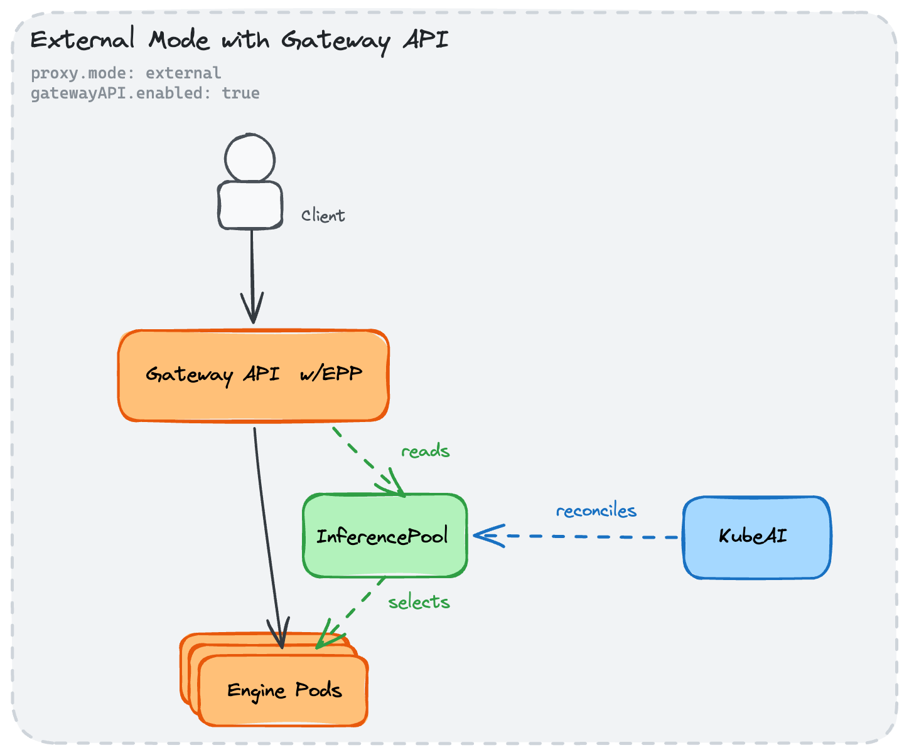

# Gateway API Inference Extension Compatibility

## Problem

KubeAI's `Model` CRD is proprietary. The Kubernetes ecosystem is converging on the [Gateway API Inference Extension](https://gateway-api-inference-extension.sigs.k8s.io/) which defines `InferencePool` (and an experimental `InferenceModel`) CRDs. This creates a risk of ecosystem isolation.

However, the `Model` CRD is significantly richer than `InferenceModel` (caching, adapters, file mounting, resource profiles, multi-engine support). Replacing it would be a regression.

## Solution

Keep the `Model` CRD. Add an optional **Bridge Controller** that watches `Model` objects and reconciles a corresponding `InferencePool` CR. This allows users to leverage KubeAI's operator for lifecycle management while delegating all traffic routing to a Gateway API-native load balancer (e.g. Envoy Gateway with EPP).

### Architecture



The bridge pairs with `proxy.mode=external`:

| Configuration | Behavior |
|---|---|
| `proxy.mode=internal` (default) | KubeAI handles all traffic routing internally. Gateway API bridge is disabled. |
| `proxy.mode=external` | KubeAI disables the built-in proxy and creates a headless Service per Model. Any external LB can discover pods. |
| `proxy.mode=external` + `gatewayAPI.enabled=true` | As above, plus KubeAI reconciles an `InferencePool` so Gateway API-native routers (Envoy Gateway + EPP) can discover and select pods. |

### Configuration

```yaml
proxy:
  mode: external
gatewayAPI:
  enabled: true
  inferencePoolName: kubeai-pool        # name of the InferencePool CR to maintain
  endpointPickerService: epp-svc        # name of the EPP Service in the same namespace
  endpointPickerPort: 9002              # defaults to 9002
```

### What KubeAI Creates

**One headless Service per Model** (standard `proxy.mode=external` behavior — owned by the `ModelReconciler`):

```yaml
apiVersion: v1
kind: Service
metadata:
  name: llama-3-1-8b-instruct-a1b2c3
spec:
  clusterIP: None
  selector:
    kubeai.org/model: llama-3.1-8b-instruct
    kubeai.org/model-uid: a1b2c3d4-e5f6-...
```

**One singleton InferencePool** (reconciled by the Bridge Controller), selecting all KubeAI-managed pods:

```yaml
apiVersion: inference.networking.k8s.io/v1alpha1
kind: InferencePool
metadata:
  name: kubeai-pool
spec:
  targetPortNumber: 8000
  selector:
    app.kubernetes.io/managed-by: kubeai
  extensionRef:
    name: epp-svc
    port: 9002
```

### Traffic Flow

```
Client → Envoy Gateway → Engine Pod (direct pod IP)
                ↑
         EPP reads InferencePool
         to discover and select endpoints
```

1. Client sends a request to Envoy Gateway.
2. Envoy Gateway calls the Endpoint Picker Process (EPP).
3. EPP reads the `InferencePool` to enumerate available pods and selects one (e.g. based on load or prefix-awareness).
4. Envoy Gateway routes the request directly to the selected pod IP on port 8000.

---

## Design Decisions

### 1. Singleton InferencePool

A single `InferencePool` selects all KubeAI-managed pods via the label `app.kubernetes.io/managed-by: kubeai`. This gives the EPP a full view of available capacity across all models, enabling cross-model load balancing and prefix-aware routing at the gateway layer.

An alternative — one `InferencePool` per `Model` — was rejected because it would require the EPP to be configured per model, defeating the purpose of delegating routing intelligence to the gateway layer.

### 2. No InferenceModel Reconciliation

`InferenceModel` exists only in the experimental `x-k8s.io/v1alpha1` API group as of `gateway-api-inference-extension v1.3.1`. It is not part of the stable `inference.networking.k8s.io/v1` API. Until it stabilises, KubeAI does not reconcile `InferenceModel` CRs to avoid a dependency on an alpha API.

### 3. gatewayAPI.enabled Requires proxy.mode=external

Running both KubeAI's internal proxy and an external Gateway API router simultaneously would cause double-proxying and conflicting routing decisions. KubeAI enforces this pairing at startup validation: `gatewayAPI.enabled=true` is rejected unless `proxy.mode=external`.

## Non-Goals

- Replacing the `Model` CRD with `InferenceModel`.
- Supporting `InferenceModel` reconciliation until its API stabilises.
- Deploying or managing Envoy Gateway or EPP — these are user-managed external components.
- Autoscaling in external mode (see [External Load Balancer proposal](external-load-balancer.md)).

## Affected Components

| Component | Change |
|---|---|
| `internal/config/system.go` | Add `GatewayAPI` config struct; validate `proxy.mode=external` requirement |
| `internal/gatewaybridge/` (new) | Controller watching `Model` objects, reconciling the singleton `InferencePool` |
| `internal/manager/run.go` | Conditionally register the bridge controller when `gatewayAPI.enabled=true` |
| `go.mod` | Add `sigs.k8s.io/gateway-api-inference-extension v1.3.1` as a direct dependency |
| `manifests/crds/` | Add `InferencePool` CRD manifest for envtest |

## References

- [Gateway API Inference Extension](https://gateway-api-inference-extension.sigs.k8s.io/)
- [InferencePool API Reference](https://gateway-api-inference-extension.sigs.k8s.io/api-types/inferencepool/)
- [External Load Balancer proposal](external-load-balancer.md)
- [llm-d Router](https://github.com/llm-d/llm-d-router)
